# Oemer (End-to-end OMR)

End-to-end Optical Music Recognition system build on deep learning models and machine learning techniques.
Default to use **Onnxruntime** for model inference. If you want to use **tensorflow** for the inference,
run `export INFERENCE_WITH_TF=true` and make sure there is TF installed.

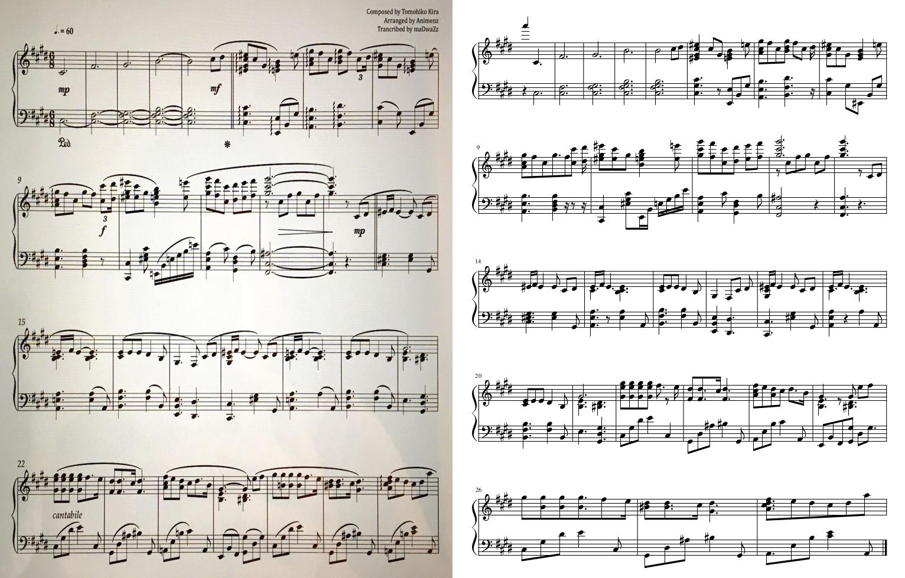

https://user-images.githubusercontent.com/24308057/136168551-2e705c2d-8cf5-4063-826f-0e179f54c772.mp4


## Quick Start
``` bash
git clone https://github.com/meteo-team/oemer
cd oemer
python setup.py install
oemer --help
```

Or download the built wheel file from the release and install
``` bash
# Go to the release page and download the .whl file from
# the assets.

# Replace the <version> to the correct version.
pip install Oemer-<version>-py3-none-any.whl
```

## Packaging
``` bash
python setup.py bdist_wheel

# Install from the wheel file
pip install dist/Oemer-<version>-py3-none-any.whl
```

## Change log level
``` bash
# Available options: debug, info, warn, warning, error, crtical
export LOG_LEVEL=debug
```


## Technical Details

This section describes the detail techniques for solving the OMR problem. The overall flow can also be found in [oemer/ete.py](https://github.com/meteo-team/oemer/blob/main/oemer/ete.py), which is also the entrypoint for `oemer` command.

Disclaimer: All descriptions below are simplfied compare to the actual implementation. Only core concepts are covered.

### Model Prediction
Oemer first predicts different informations with two image semantic segmentation models: one for
predicting stafflines and all other symbols; and second model for more detailed symbol informations,
including noteheads, clefs, stems, rests, sharp, flat, natural.


<p align='center'>
    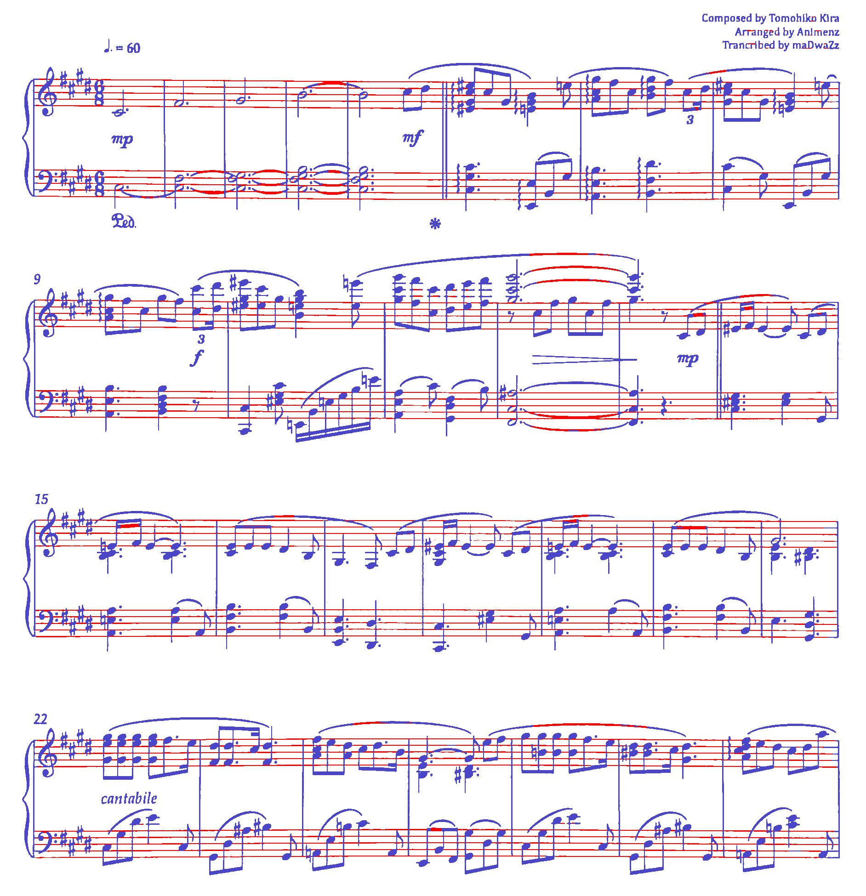
    <p align='center'>Model one for predicting stafflines (red) and all other symbols (blue).</p>
</p>
<p align='center'>
    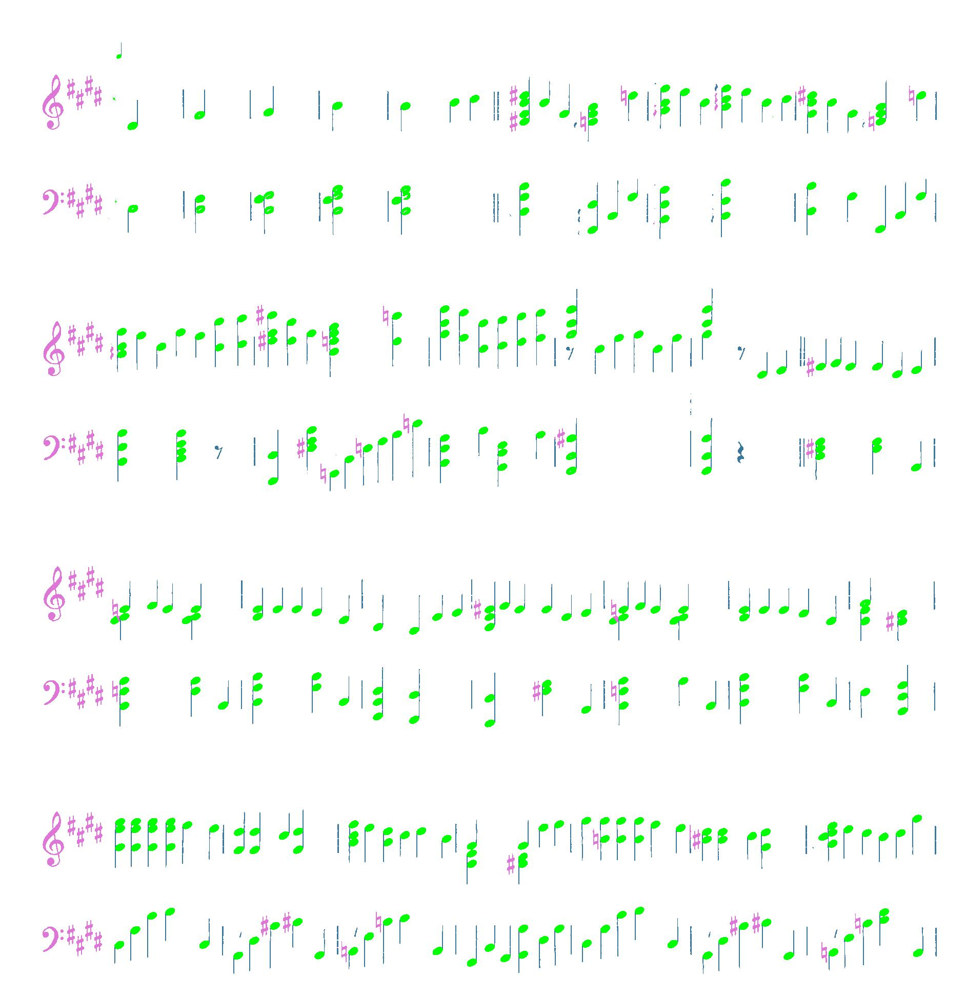
    <p align='center'>Model two for predicting noteheads (green), clefs/sharp/flat/natural (pink), and stems/rests (blue).</p>
</p>

### Dewarping

Before proceed to recognizing the symbols, one may need to deskew the photo first since 
the later process assumes the stafflines are all horizontally aligned and the position 
of noteheads, rests and all other things are all depends on this assumption.

For the dewarping, there can be summarized to six steps as shown in the below figure.

<p align='center'>
    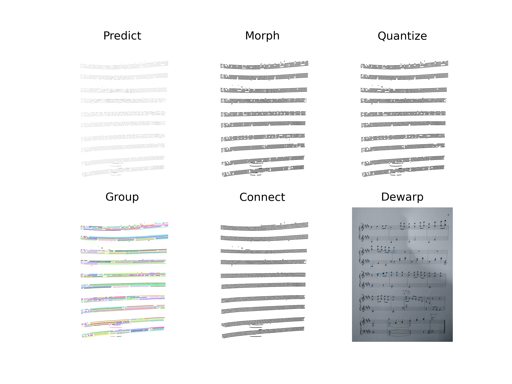
    <p align='center'>Steps to dewarp the curved image.</p>
</p>


The dewarping map will be apply to all the predicted informations by the two models.

### Staffline Extraction

After dewarping, stafflines will be parsed. This step plays the most important role,
as this is the foundation to all the later steps. Ths most important information is 
`unit_size`, which is the interval between stafflines. It's obvious that all the sizes,
distance-related information in a music score all relate to the interval, or gap, of stafflines.

The stafflines are processed part-by-part horizontally, as shown below:

<p align='center'>
    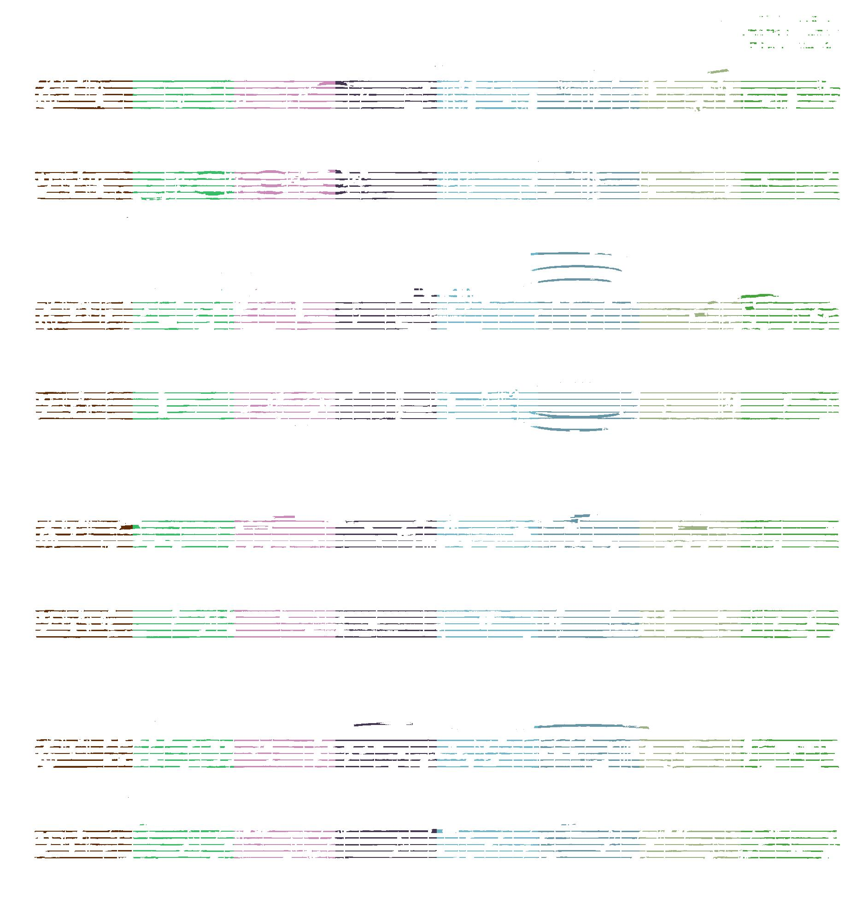
</p>

For each part, the algorithm finds the lines by accumulating positive pixels by rows.
After summarizing the counts for each row, we get the following statistics:

<p align='center'>
    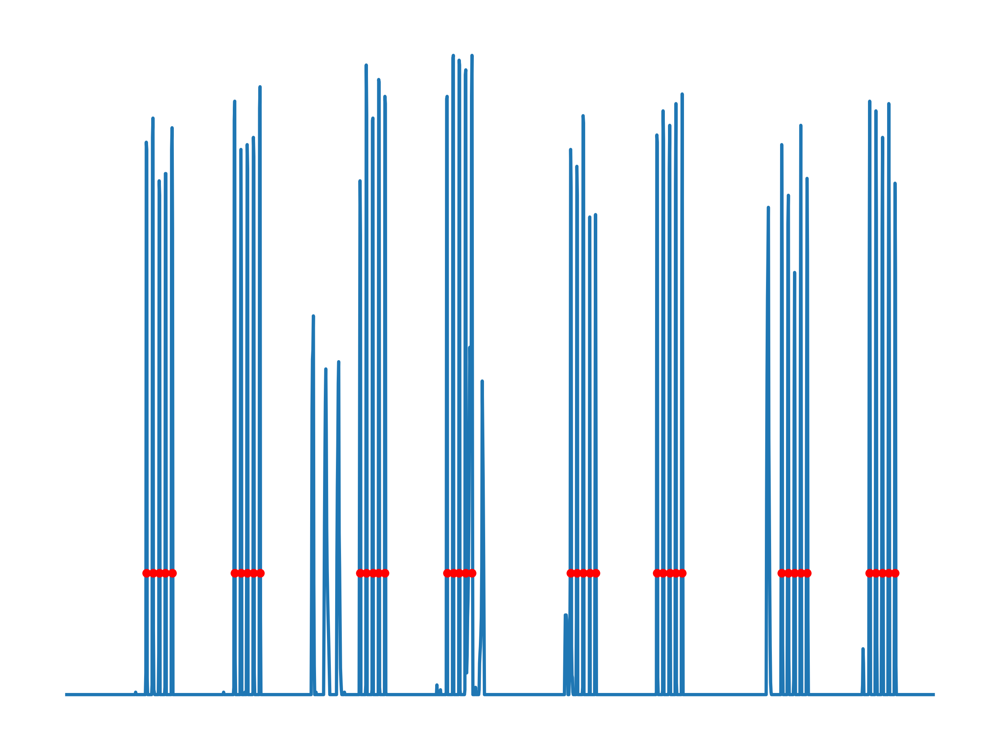
</p>

The algorithm then picks all the peaks and applies additional rules to filter out false positive peaks.
The final picked true positive peaks (stafflines) are marked with red dots.

Another important information is **tracks** and **groups**. For a conventional piano score, there are
two tracks, for left and right hand, respectively, and forms a group. For this information,
the algorithm *foresees* the symbols predictions and parse the barlines to infer possible
track numbers.

After extraction, the informations are stored into list of `Staff` instances. Example 
`Staff` instance representation is as follow:

``` bash
# Example instance of oemer.staffline_extraction.Staff
Staff(
    Lines: 5  # Contains 5 stafflines.
    Center: 1835.3095048449181  # Y-center of this block of staff.
    Upper bound: 1806  # Upper bound of this block of staff (originated from left-top corner).
    Lower bound: 1865  # Lower bound of this block of staff (originated from left-top corner).
    Unit size: 14.282656749749265  # Average interval of stafflines.
    Track: 1  # For two-handed piano score, there are two tracks.
    Group: 3  # For two-handed piano score, two tracks are grouped into one.
    Is interpolation: False  # Is this block of staff information interpolated.
    Slope: -0.0005315575840202954  # Estimated slope
)
```

### Notehead Extraction

The next step is to extract noteheads, which is the second important information to be parsed.

Steps to extract noteheads are breifly illustrated in the following figure:

<p align='center'>
    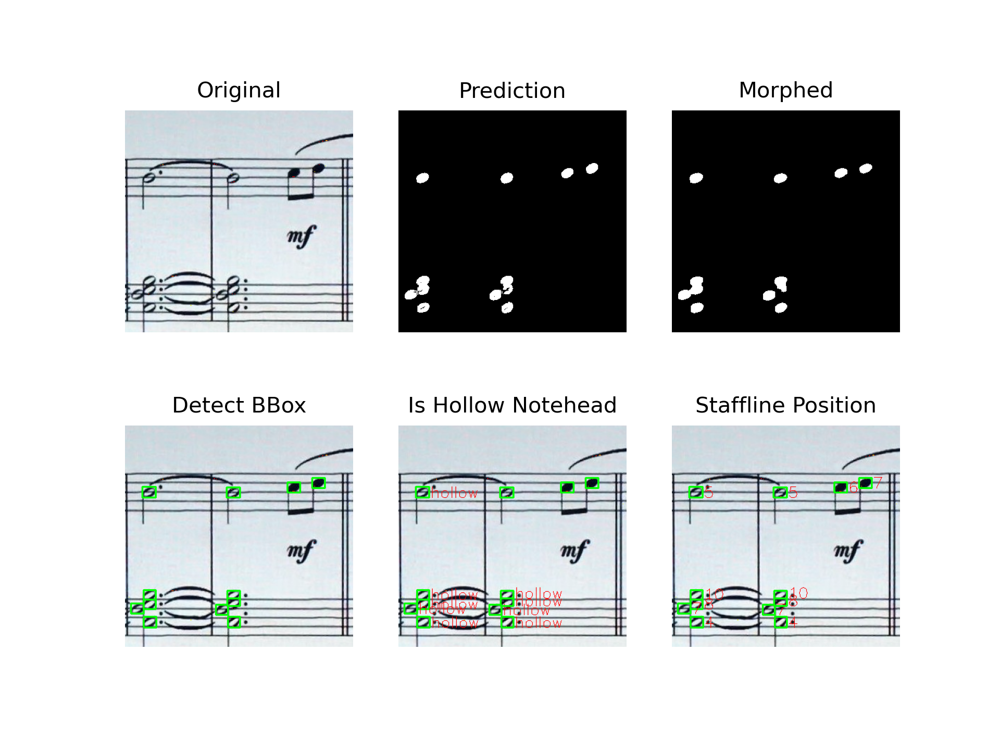
</p>


One of the output channel of the second model predicts the noteheads map, as can be seen in the
top-middle image. The algorithm then pre-process it with morphing to refine the information.
Worth noticing here is that we force the model to predict 'hollow' notes to be solid noteheads,
which thus the information won't be eliminated by the morphing.

Next, the algorithm detects the bounding boxes of each noteheads. Since the noteheads could
overlap with each other, the initial detection could thus contain more than one noteheads. 
To deal with such situation, the algorithm integrate the information `unit_size` to approximate
how many noteheads are actually there, in both horizontal and vertical direction. The result
is shown in the bottom-left figure.

As we force the model to predict both half and whole notes to be solid noteheads, we need to
setup rules to decide whether they are actually half or whole notes. This could be done by
simply compare the region coverage rate between the prediction and the original image.
The result is shown in the bottom-middle figure.

Finally, the last thing to be parsed is the position of noteheads on stafflines. The origin
starts from the bottom line space with (D4 for treble clef, and F3 for bass clef) index 0.
There could be negative numbers as well. In this step, noteheads are also being assigned with
track and group number, indicating which stave they belong to. The bottom-right figure shows
the result.


``` bash
# Example instance of oemer.notehead_extraction.NoteHead
Notehead 12 (  # The number refers to note ID
    Points: 123  # Number of pixels for this notehead.
    Bounding box: [649 402 669 419]
    Stem up: None  # Direction of the stem, will be infered in later steps.
    Track: 1
    Group: 0
    Pitch: None  # Actual pitch in MIDI number, will be infered in later steps.
    Dot: False  # Whether there is dot for this note.
    Label: NoteType.HALF_OR_WHOLE  # Initial guess of the rhythm type.
    Staff line pos: 4  # Position on stafflines. Counting from D4 for treble clef.
    Is valid: True  # Flag for marking if the note is valid.
    Note group ID: None  # Note group ID this note belong to. Will be infered in later steps.
    Sharp/Flat/Natural: None  # Accidental type of this note. Will be infered in later steps.
)

```

### Note Group Extraction

This step groups individual noteheads into chords that should be played at the same time.

A quick snippet of the final result is shown below:

<p align='center'>
    
</p>

The first step is to group the noteheads according mainly to their distance vertically, and then
the overlapping and a small-allowed distance horizontally.

After the initial grouping, the next is to parse the stem direction and further use this
information to refine the grouping results. Since there could be noteheads that are vertically
very close, but have different directions of stems. This indicates that there are two
different melody lines happening at the same time. This is specifically being considered
in `oemer` and taken care of over all the system.

``` bash
# Example instance of oemer.note_group_extraction.NoteGroup
Note Group No. 0 / Group: 0 / Track: 0 :(
    Note count: 1
    Stem up: True
    Has stem: True
)
```

### Symbol Extraction

After noteheads being extracted, there remains other important musical annotations need
to be parsed, such as keys, accidentals, clefs, and rests.
As mentioned before, the second model predicts different pairs of symbols in the same channel
for the ease of training. Additional separation of the information is thus required.

#### Clefs & SFN
For the clefs/sfn (short for sharp, flat, natural) pair, the initial intention for grouping
them together, is that it's easier to distinguish the difference through their size and
the region coverage rate (tp_pixels / bounding_box_size). This is exactly what the
algorithm being implemented to recognize them. After the clef/sfn classification,
Further recognition leverages SVM models to classify them into the correct symbol
types (e.g. gclef, sharp, flat).

<p align='center'>
    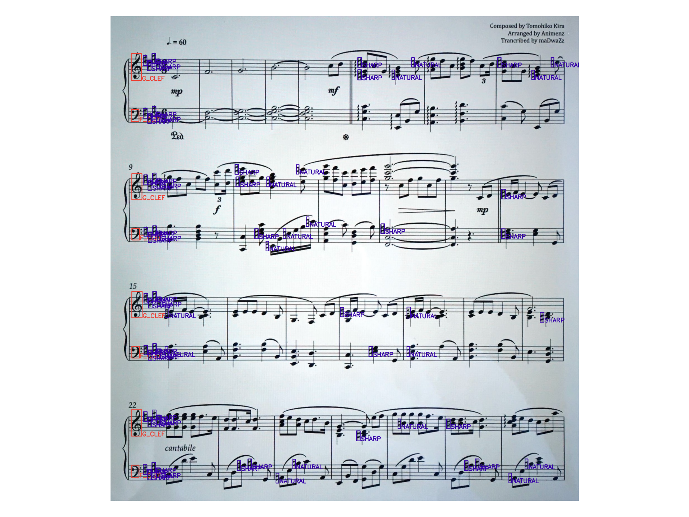
</p>

``` bash
# Example instance of oemer.symbol_extraction.Clef
Clef: F_CLEF / Track: 1 / Group: 1

# Example instance of oemer.symbol_extraction.Sfn
SFN: NATURAL / Note ID: 186 / Is key: False / Track: 0 / Group: 0
```

#### Barlines

Extracts barlines using both models' output. The algorithm first uses the second model's prediction,
the channel contains rests and 'stems' (which should be 'straight lines' actually). Since the
previous step while extracting note groups has already used the 'stem' information, so the rest
part of unused 'stems' should be barlines. However, due to some bugs of the training dataset,
the model always predicts barlines, that should be longer than stems, into the same length of
stems. It is thus the algorithm needs the first model's output to extract the 'actual' barlines
with real lengths. By overlapping the two different information, the algorithm can easily filter out
most of non-barline objects in the prediction map. Further extraction applies additional rules to
estimate barlines. The result can be seen as follow:

<p align='center'>
    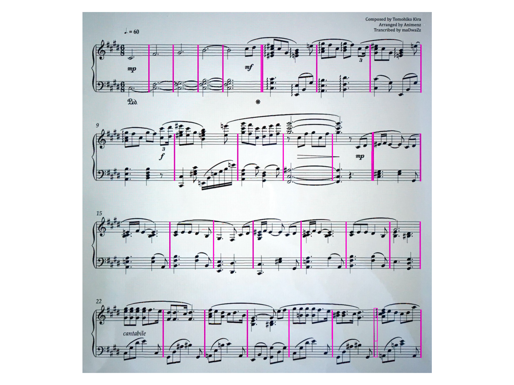
</p>

And the representation of a barline instance:
``` bash
# Example instance of oemer.symbol_extraction.Barline
Barline / Group: 3
```

There is no track information of barline since one barline is supposed to 
occupy multiple tracks.

#### Rests

Having used all the 'stems' information in the output channel during the last few
steps, the rest symbols should be 'rests'. List of rules are also applied to
filter the symbols. The recognition of the rest types are done by using trained SVM model.
As a result, above process outputs the following result:

<p align='center'>
    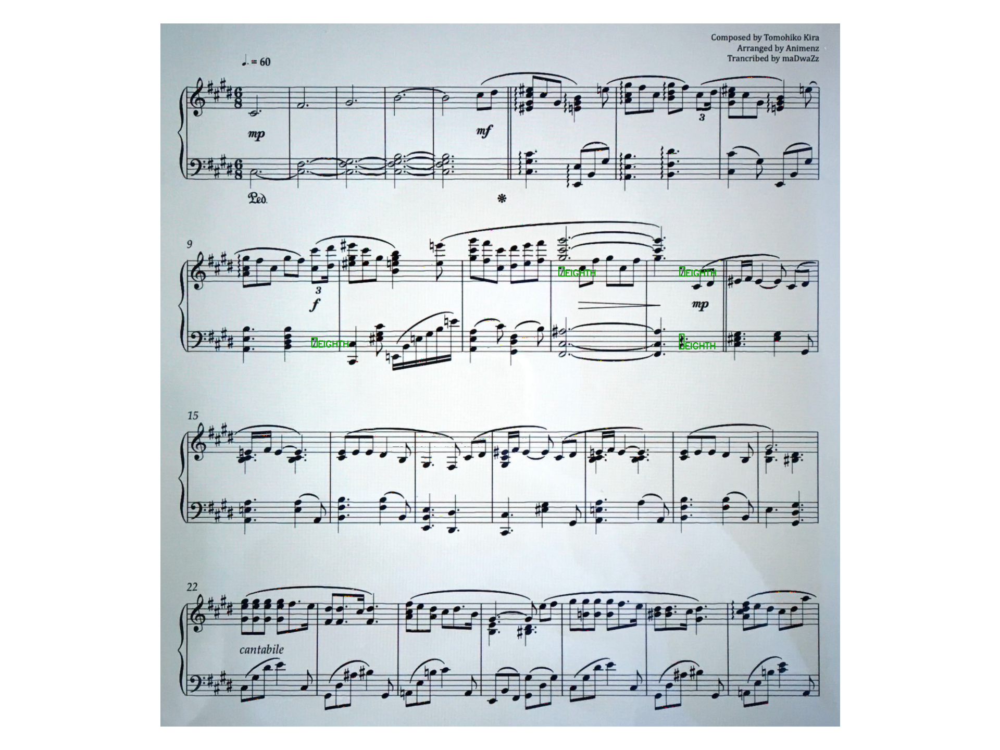
</p>

Representation of the rest instance:
``` bash
# Example instance of oemer.symbol_extraction.Rest
Rest: EIGHTH / Has dot: None / Track: 1 / Group: 1
```


### Rhythm Extraction

This is probably the most time consuming part except for the model inference.
There are two things that effect the rhythm: dot and beams/flags. The later two (beams, flags)
are considered the same thing in the extraction. In this step, model one's prediction
is used, including both channels (stafflines, symbols). This process updates attributes
in-place.

The algorithm first parse the information of dot for each note. The symbols map is first
subtracted by other prediction maps (e.g. stems, noteheads, clefs, etc.), and then use
the remaining part for scanning the dots. Since the region of a dot is small, the algorithm
morphs the map first. After amplifying the dot information, the algorithm scans a small region
nearby every detected noteheads, calculate the ratio of positive samples to the region, and
determine whether there is a dot by a given certain threshold.

<p align='center'>
    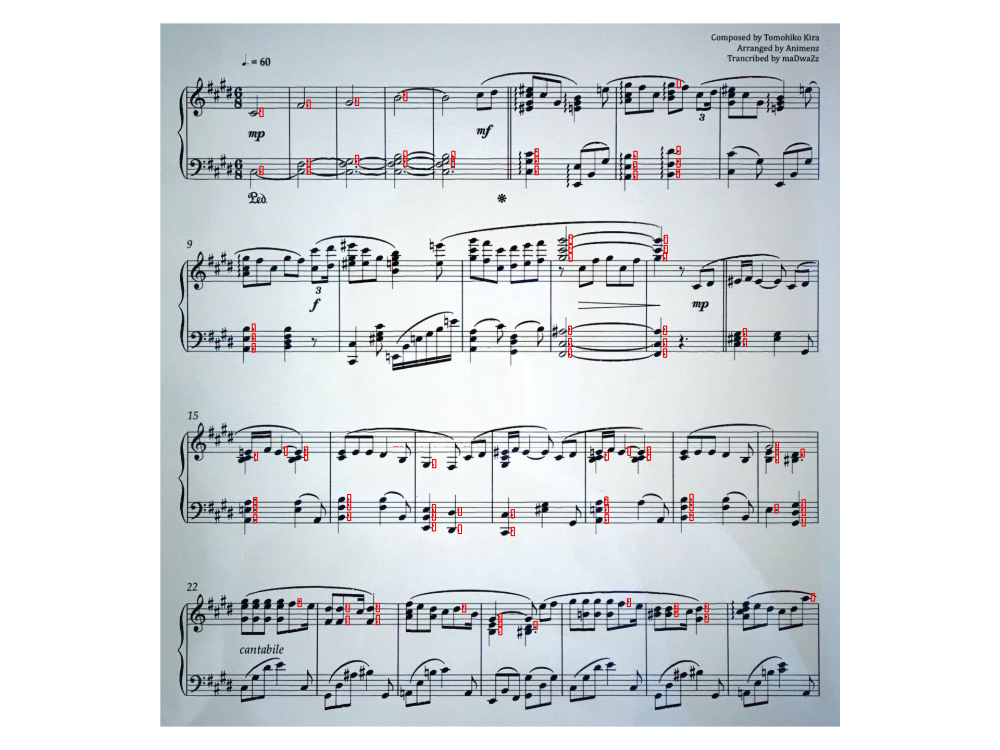
</p>

Here comes the most difficult and critical part amongst all steps, since rhythm hugely
influence the listening experience.
Few steps are included to extract beams/flags:
- Initial parsing
- Check overlapping with noteheads and stems
- Correlate beams/flags to note groups
- Assign rhythm types to note groups and **update the note grouping** when neccessary.

Brief summary of these steps are illustrated as below:

<p align='center'>
    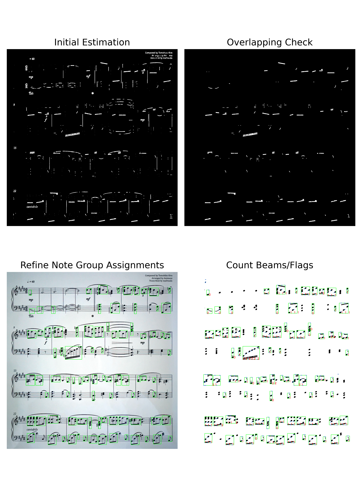
</p>

The first step is, as mentioned before, to distill beams/flags from all the symbols predicted
by model one. By subtracting with the second model's output, and apply some simple filtering rules,
we get the top-left figure.

Next, the algorithm picks the regions that overlap with known noteheads and stems. We also
get an initial relation between note groups and beams/flags. Both information are kept for
later usage. As a result, the algorithm generates the top-right figure.

The third step is to refine the relation between note groups and beams. Since 
there could be stem of one note group that doesn't overlap with the beam above/below it, and
thus not being included in the same bounding box.  Here, bounding box includes both note group and
beams/flags. This can be adjusted by further scans the region under the bounding box, check
if there contains unknown note groups, and update the relation. Figure is shown in bottom-left.

Finally, the algorithm has all neccessary information to conclude the rhythm types for
each note group now. The algorithm scans a small region for counting how many beams/flags there are.
The region is bounded by the center of the x-axis of the note group, with extention to both left and
right side; the y-axis by the bounding box and the boundary of the note in the note group that
closest to the beams (depending on the direction of the stem). Figure on the bottom-right shows
the region of bounding boxes (green), the scanning range (blue), and the final number of beams/flags
detected by the algorithm. Numeber of rules are also applied to refine the counting result.

In the last step, there is another important mission is to **update the note grouping**, which
means further check the legitmacy of each note group, and separate them into upper and lower
part if neccessary. Since `oemer` takes multi-melody line into consideration, it is not
possible until we collect all the fundamental information to finally determine there is indeed multiple
melody lines in the note group. That is why in the last step here, the algorithm
checks the grouping again.

### Build MusicXML

The process of building MusicXML document follows the **event-based** (objective used in `oemer`
is 'action') mechanism, which essentially means there are different event types, and each
has their own attributes and differently behaviors when being triggered.
The process goes to construct a sequence of events first, and trigger them one-by-one later.
This eventually yields a series of XML strings. A global context is shared across each events,
which plays a key role for holding the music context while decoding.

A brief summary of steps are listed:

1. Sort symbols first by groups, then x-axis position.
2. Initialize the first measure with clef and key information.
3. Determine the alignment between notes/rests in different tracks.
4. Adjust the rhythm of notes/rests or adding rests to make sure the aligned symbols are at the same beat position.
5. Decode the sequence and generate the MusicXML document.

#### Sort

Sort all the instances previously generated by their groups and x-axis, then cluster them into measures.
It's obvious this step is to mitigate how human interpret a music sheet. The status of accidentals are
reset for each measure, rhythm types, chord prgression, etc.


#### Initialize

The initial state of clef type for each track and the key type.
This step includes an important algorithm: key finding. The algorithm can be split down into few steps:

1. Decide if the current measure contains key.

    Check the first few occurance of symbols that are instance of `Sfn`. If there isn't any, return key
    type of C-major.
    If yes, then go to the next step.

2. Define the scan range.

    If the current measure is at the beginning of that row (track), then the first *track_nums* of symbols
    types should be `Clef`, then comes the key.
    Then the end of the scanning, since there are at most 6 sharps/flats of the key (ignoring some special
    cases that the key changes after the double barlines, which may contain naturals), this offset plus
    4 as the tolerance are added to the beginning index.

3. Count occurance

    Count number of occurance of predicted `Sfn` types. Store this information for later process.

4. Check the validity

    Checks if all tracks have the same label (i.e. all flats, all sharps).
    If not, count the most occurance of `Sfn` types. Use this as the label type (i.e. sharp or flat).
    There are more advanced rules being applied in this process. Please check the source code for
    the details.

5. Return key type

    Count the occurance of `Sfn` instances, use the sharp/flat information, and combine the two
    to determine the final key type.


#### Symbol Alignment


#### Beat Adjustment


#### Decode
